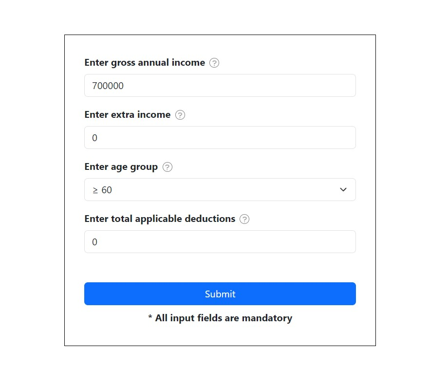
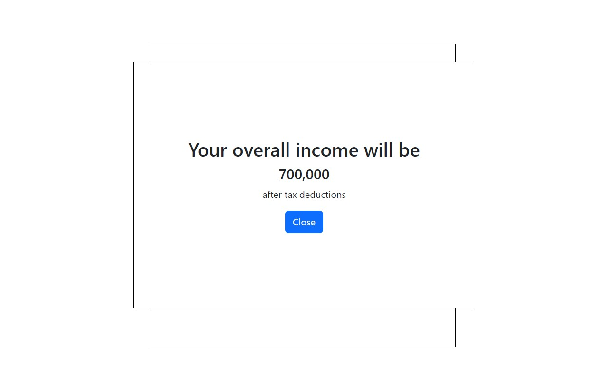
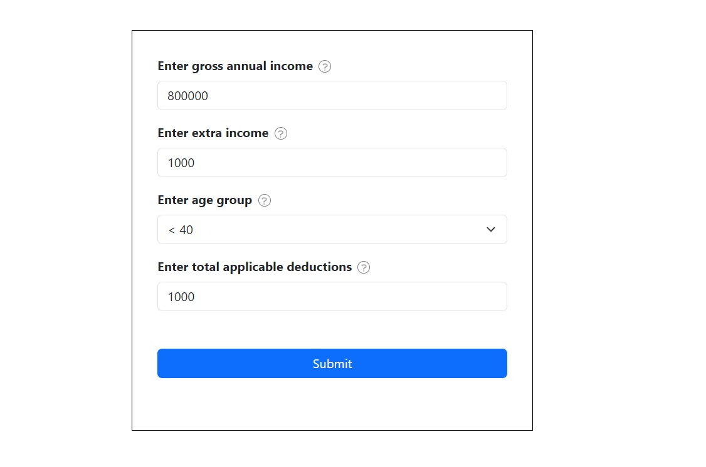
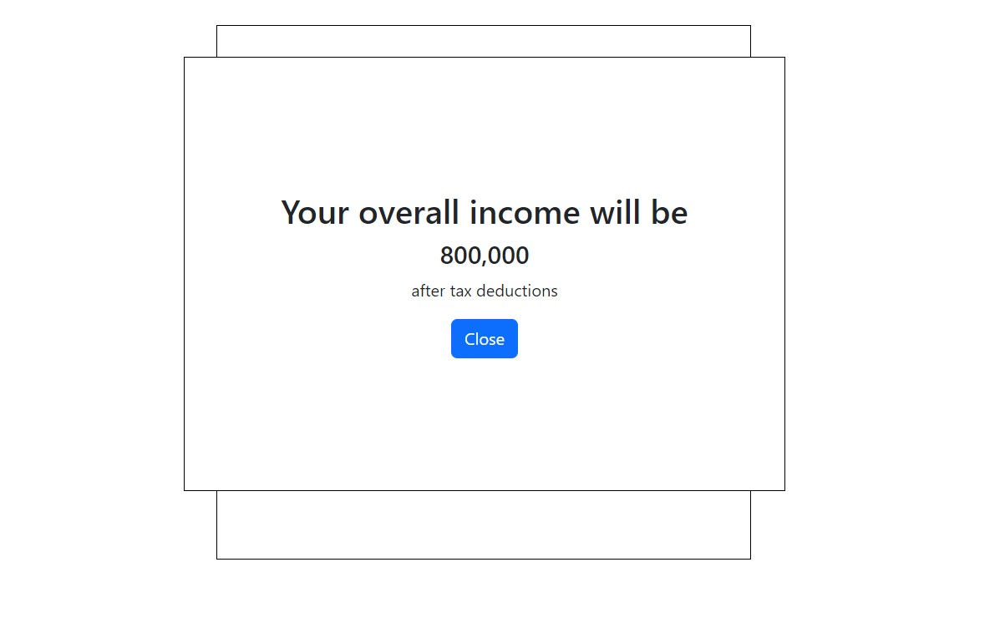
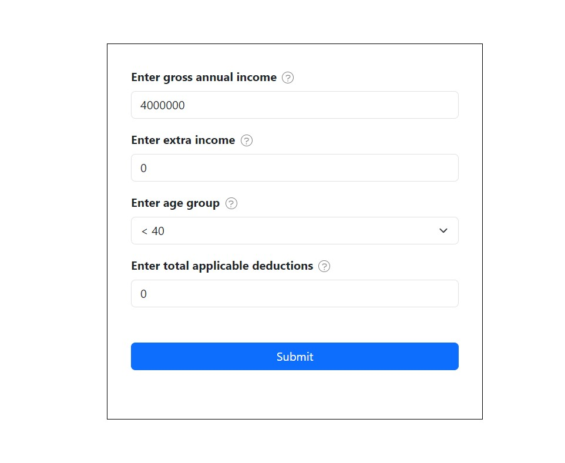

# Fyle Assignment
## Tax Management

### Tech Stack
- Language: javascript,HTML ,CSS
- Deploy: vercel

### Link
Deployed URL: https://fyle-assignment-rho.vercel.app/

### Test Case 

#### Total income <= 8 lakh
- when the total income after deduction is less than or equal to 8 lakh there should be no tax.

#### Total income > 8 lakh
- when the total income after deduction is less than or equal to 8 lakh there should be tax according to age.

- 30% for people with age < 40
- 40% for people with age ≥ 40 but < 60
- 10% for people with age ≥ 60

